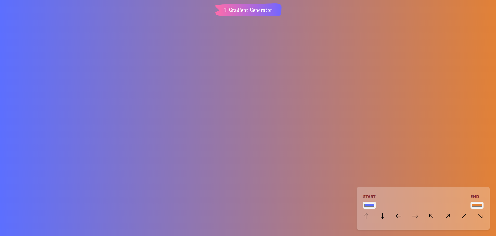

# Gradient Generator App

This is a React application for generating custom CSS gradients. It allows users to choose start and end colors, as well as the gradient direction.

## How to Use

1. Clone this repository to your local machine or download it.
2. Navigate to the project directory.
3. Install dependencies with `npm install`.
4. Start the development server with `npm run dev`.
6. Customize the gradient colors and direction using the controls provided.
7. Copy the generated CSS code and use it in your projects.

## Technologies Used

- React.js
- useState hook for managing state
- Tailwind CSS for styling

## Future Improvements

- Allow users to add more color stops for creating complex gradients.
- Implement gradient presets for quick selection.
- Add support for radial gradients.

Enjoy creating beautiful gradients with Gradient Generator App!
